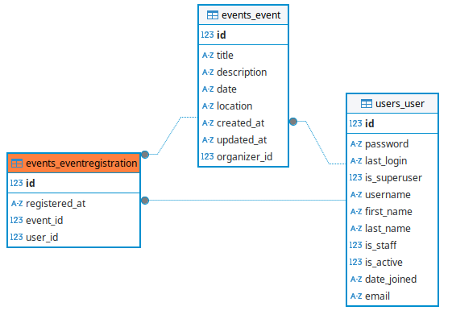
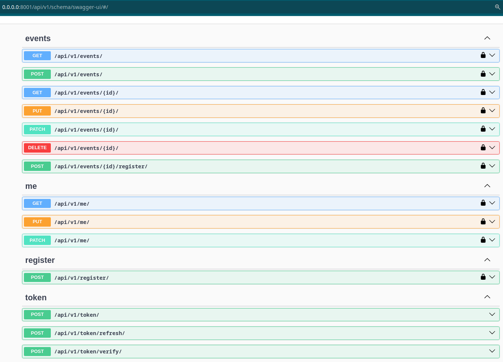

# Event Management API

## Table of Contents

- [Task](#task)
- [Installation](#installation)
- [Run with docker](#run-with-docker)
- [Getting access](#getting-access)
- [Tech Stack](#tech-stack)
- [Features](#features)
- [DB Structure](#db-structure)

## Task

Develop a Django REST-Api for Event Management
The primary goal of this task is to create a Django-based REST-Api
that manages events (like conferences, meetups, etc.). The
application will allow users to create, view, update, and delete events.
It should also handle user registrations for these events.

Key Requirements
- Design an Event model with fields such as title, description,
date, location, and organizer.
- Implement CRUD (Create, Read, Update, Delete) operations for
the Event model.
- Basic User Registration and Authentication.
- Event Registration
- API documentation
- Docker
- Readme file
Bonus Points
- Implement an advanced feature like event search or filtering.
- Add a feature for sending email notifications to users upon event
registration.

## Installation

```bash
git clone https://github.com/AlexTsikhun/django-event-management
cd django-event-management
# SET ENV VARS, see `.env.sample` 
```

## Run with docker

```bash
docker compose up --build --watch
```

## Getting access

- API Root `api/v1/`
- Docs: `api/v1/schema/swagger-ui/`

## Tech Stack

- Django/DRF/Django ORM
- SQLite
- Celery/Redis
- django-filter
- simplejwt
- drf-spectacular
- Docker & Docker Compose
- Pydantic

## Features:

- CRUD operations for events
- User registration and JWT authentication
- Event registration with email notifications
- Advanced event filtering by title, location, and date range
- Docker containerization

This project involves creating a Django REST Framework-based API for managing events and user registrations. The API supports CRUD operations for events, user registration, and event registration, with features like JWT authentication, email notifications (with Celery), and advanced event filtering. The implementation follows Clean Architecture principles,  and adheres to the HackSoftware/Django-Styleguide. The project is containerized with Docker, includes API documentation.

#### DB Structure:




Swager docs image:



<details style="border: 1px solid #ccc; padding: 10px; margin-bottom: 10px">
<summary style="font-size: 1.17em; font-weight: bold; ">Future work</summary>

- refactor with union architecture

</details>
